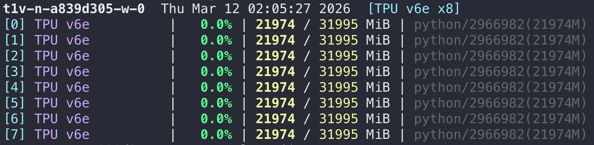

# tpustat

`tpustat` is the TPU equivalent of the `gpustat` workflow:

- `nvidia-smi` -> `gpustat`
- `google-smi` -> `tpustat`

It turns the verbose TPU table into a compact one-line-per-device view, while still supporting JSON output, watch mode, and richer process details when needed. By default it uses the local `google_smi` Python package and falls back to `google-smi --json`.



## Install

```bash
# install from GitHub
pip install git+https://github.com/bzantium/tpustat.git

# or install locally for development
pip install -e .
```

## Quick Start

```bash
# compact default view
tpustat

# include bus / NUMA / IOMMU details
tpustat --show-all

# show explicit process fields
tpustat -c -u -p

# machine-readable output
tpustat --json

# refresh continuously
tpustat -i
tpustat -i 0.5

# generate shell completion
tpustat --print-completion bash
tpustat --print-completion zsh
```
